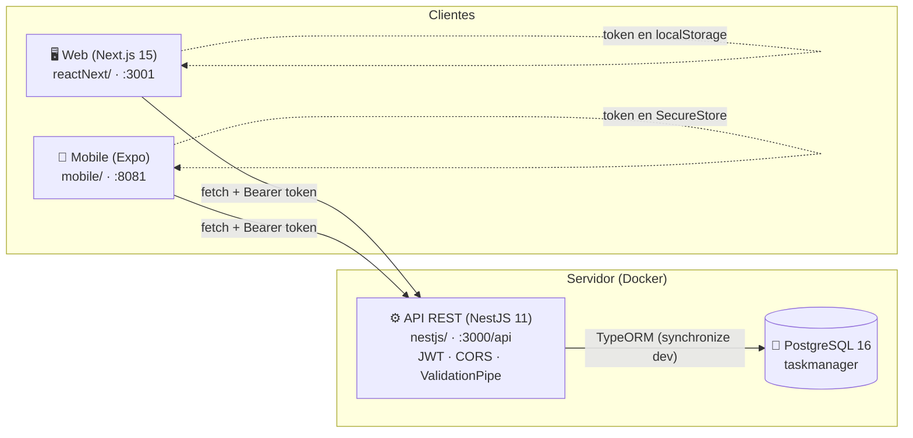

# Task Manager — Sistema de Gestión de Tareas

Sistema full-stack de gestión de tareas con **autenticación JWT** y **CRUD de
tareas**, desplegable en un solo comando. Tres proyectos comparten el mismo
backend: una **API REST**, un **dashboard web** y una **app móvil** (mismo
diseño y misma arquitectura por features).

## Componentes

| Componente | Carpeta | Stack | Puerto | Documentación |
|---|---|---|---|---|
| **Backend API** | [`nestjs/`](nestjs/README.md) | NestJS 11 · TypeScript · PostgreSQL 16 · TypeORM · JWT | `3000` | [README](nestjs/README.md) |
| **Web App (dashboard)** | [`reactNext/`](reactNext/README.md) | Next.js 15 (App Router) · React 19 · Tailwind v4 | `3001` | [README](reactNext/README.md) |
| **Mobile App** | [`mobile/`](mobile/README.md) | Expo SDK 57 · Expo Router · React Native 0.86 | `8081` (web) | [README](mobile/README.md) |

## Arquitectura



```mermaid
sequenceDiagram
    autonumber
    participant C as Cliente (Web / Mobile)
    participant A as API (:3000/api)
    participant D as PostgreSQL

    C->>A: POST /auth/register {username, email, password}
    A->>D: INSERT user (bcrypt hash)
    A-->>C: 201 { access_token, user }
    Note over C: persiste el token<br/>(localStorage / SecureStore)

    C->>A: GET /tasks  (Authorization: Bearer <jwt>)
    A->>A: JwtAuthGuard valida el token
    A->>D: SELECT tasks
    A-->>C: 200 [ { id, title, status, ... } ]

    C->>A: POST /tasks { title, ... }  (Bearer)
    A->>D: INSERT task
    A-->>C: 201 { task }

    C->>A: PATCH /tasks/:id { status }  (Bearer)
    A->>D: UPDATE task
    A-->>C: 200 { task }

    C->>A: DELETE /tasks/:id  (Bearer)
    A->>D: DELETE task
    A-->>C: 200

    note over C,A
      Ante un 401 el cliente limpia la sesión
      y redirige a /login
    end note
```

**Cómo se conecta todo:** los clientes hablan **directo** con la API desde el
navegador/dispositivo (sin proxy): `http://localhost:3000/api`. La API expone el
puerto 3000 en el host y su CORS acepta `http://localhost:3001` (web) y
`http://localhost:8081` (mobile web). El `JWT_SECRET` vive en `nestjs/.env` y
**no** se quema en la imagen Docker.

## Quick start (Docker)

Requisitos: Node 20+, Docker + Docker Compose.

```bash
# desde la raíz del repo
docker compose up --build
```

| Servicio | URL |
|---|---|
| Web (dashboard) | http://localhost:3001 |
| API + health | http://localhost:3000/api · http://localhost:3000/api/health |
| PostgreSQL | `localhost:5432` (volumen `taskmanager_data`) |

```bash
docker compose logs -f api   # seguir logs
docker compose down          # parar (conserva la BD)
docker compose down -v       # parar y BORRAR la BD
```

> ⚠️ Si antes levantaste el stack desde `nestjs/` (otro compose, mismo nombre
> de contenedor `task-manager-db`), elimina el contenedor viejo antes:
> `docker rm -f task-manager-db`.

## Desarrollo manual (sin Docker para la web)

```bash
# 1) BD + API  (terminal 1)
cd nestjs
npm install
npm run db:up        # sube solo Postgres (compose de nestjs/)
npm run start:dev    # API en :3000 con auto-reload

# 2) Web  (terminal 2)
cd reactNext
npm install
npm run dev -- -p 3001    # http://localhost:3001

# 3) Mobile web  (terminal 3)
cd mobile
npm install
npm run web               # http://localhost:8081
```

## Pruebas E2E

| Suite | Proyecto | Herramienta | Tests | Comando |
|---|---|---|---|---|
| API: auth + tasks | `nestjs/test/e2e/` | Jest + Supertest | 32 | `cd nestjs && npm run db:up && npm run db:test:prepare && npm run test:e2e` |
| Web: flujo completo | `reactNext/tests/e2e/` | Playwright (Chromium) | 11 | `cd reactNext && npx playwright install chromium && npm run test:e2e` |

- **API:** corre contra una BD de pruebas dedicada (`taskmanager_test`), sin
  tocar los datos de desarrollo. Cada suite hace `TRUNCATE` al inicio.
- **Web:** Playwright arranca `next dev` en :3001 (o reutiliza el contenedor
  Docker de la web) y usa la API real en :3000.

## Estructura del repo

```
ADN/
├── docker-compose.yml    # stack completo: db + api + web
├── nestjs/               # API REST (NestJS) + compose de solo-Postgres + Dockerfile
├── reactNext/            # Web dashboard (Next.js) + Dockerfile
├── mobile/               # App móvil (Expo) — no se conteneuriza
└── README.md             # ← este documento
```

## Variables de entorno (resumen)

| Variable | Dónde | Default |
|---|---|---|
| `JWT_SECRET` | `nestjs/.env` | — (requerido) |
| `DB_*` | `nestjs/.env` | `localhost:5432/taskmanager` |
| `CORS_ORIGIN` | compose raíz | `http://localhost:3001,http://localhost:8081` |
| `NEXT_PUBLIC_API_URL` | web (bundle) | `http://localhost:3000/api` |
| `EXPO_PUBLIC_API_URL` | `mobile/.env` | `http://localhost:3000/api` |

Detalle completo en cada [README](#componentes) del componente.

## Notas de diseño (PoC)

- **Acceso abierto entre usuarios:** cualquier usuario autenticado ve/edita
  cualquier tarea (`createdByUserId` es informativo). En producción: restringir
  al dueño (protección IDOR).
- **`synchronize: true`** solo en dev; producción usa migraciones
  (`npm run migration:generate` / `migration:run` en `nestjs/`).
- **JWT sin refresh token:** expira a la hora; el usuario vuelve a loguear.
- La app móvil replica el diseño y la arquitectura por features de la web
  (`core` → `features` → `shared`), con el token en `expo-secure-store`.
